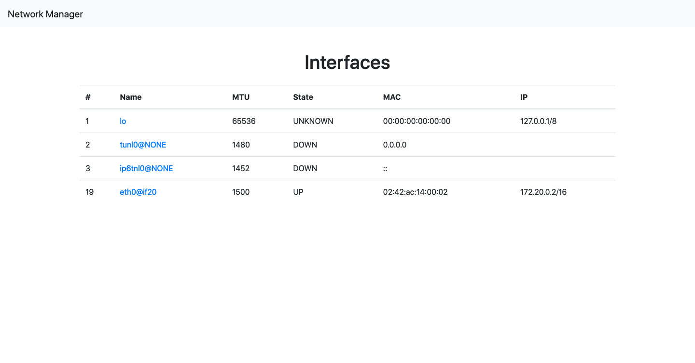

# IPRoute2 App

- [Layout](#layout)
- [User Interaction](#user-interaction)

## Layout

---

> Links:
>
> - [http://localhost:8080/public/](http://localhost:8080/public/)

> Links:
>
> - [http://localhost:8080/public/link.html?info=link&link=eth0](http://localhost:8080/public/link.html?info=link&link=eth0)

## User Interaction

---

<video width="100%" height="100%" autoplay loop controls>
  <source src="assets/layout.mp4" type="video/mp4">
</video>
