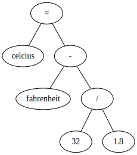
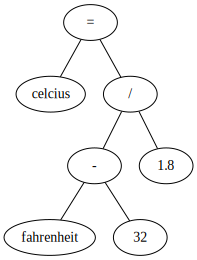

# [Operator](http://php.net/manual/en/language.operators.php)

- [Operator Precedence](#operator-precedence)
- [Arithmetic Operators](#arithmetic-operators)
- [Assignment Operators](#assignment-operators)
- [Bitwise Operators](#bitwise-operators)
- [Comparations Operators](#comparations-operators)
- [Ternary Operator](#ternary-operator)
- [Null Coalescing Operator](#null-coalescing-operator)
- [Error Control Operators](#error-control-operators)
- [Execution Operators](#execution-operators)
- [Increment and Decrement Operators](#increment-and-decrement-operators)
- [Logical Operators](#logical-operators)
- [String Operators](#string-operators)
- [Array Operators](#array-operators)
- [Type Operators](#type-operators)
- [Operators List](#operators-list)

## [Operator Precedence](http://php.net/manual/en/language.operators.precedence.php)

---

<!--
\begin{align*}
C = \frac{F - 32}{1.8}
\end{align*}
 -->


### Option 1

```php
$fahrenheit = 50;
$celsius = $fahrenheit - 32 / 1.8;
var_dump($celsius);   //=> float(32.222222222222)
```



### Option 2

```php
// grouping operator
$fahrenheit = 50;
$celsius = ($fahrenheit - 32) / 1.8;
var_dump($celsius); //=> float(10)
```



## [Arithmetic Operators](http://php.net/manual/en/language.operators.arithmetic.php)

---

```php
// unary identity operator
$number = "15";
var_dump($number);  //=> string(2) "15"
var_dump(+$number); //=> int(15)
```

```php
// unary negation operator
$number = -15;
var_dump($number);  //=> -15 11111111111111111111111111110001
var_dump(+$number); //=>  15 00000000000000000000000000001111
```

```php
// addition operator
var_dump(10 + 3);             //=> int(13)
var_dump("10" + 3);           //=> int(13)
var_dump(true + 3);           //=> int(4)
```

```php
// subtraction operator
var_dump(10 - 3);             //=> int(7)
var_dump(1.4 - 1.2);          //=> float(0.2)
```

```php
// multiplication operator
var_dump(10 * 3);             //=> int(30)
```

```php
// division operator
var_dump(10 / 3);             //=> float(3.3333333333333)
var_dump((int) (10 / 3));     //=> int(3)   - Integer division
var_dump(round(10 / 3));      //=> float(3) - Integer division
```

```php
// remainder operator
var_dump(10 % 3);             //=> int(1)
```

```php
// exponentiation operator
var_dump(10 ** 3);            //=> int(1000);  before php 5.6: pow(10, 3)
```

## [Assignment Operators](http://php.net/manual/en/language.operators.assignment.php)

---

```js
// assign operator
$variable = 10;
var_dump($variable); //=> int(10)
```

Shorthand: `+=`, `-=`, `*=`, `**=`, `/=`, `.=`, `%=`, `&=`, `|=`, `^=`, `<<=`, `>>=`

```js
// addition assignment operator
$variable = 10;
$variable += 1;      // $variable = $variable + 1
var_dump($variable;) //=> int(11)
```

## [Bitwise Operators](http://php.net/manual/en/language.operators.bitwise.php)

---

```php
// bitwise and operator
var_dump(9);        //=> 00000000000000000000000000001001  int(9)
var_dump(14);       //=> 00000000000000000000000000001110  int(14)
var_dump(14 & 9);   //=> 00000000000000000000000000000100  int(8)
```

```php
// bitwise or operator
var_dump(9);        //=> 00000000000000000000000000001001  int(9)
var_dump(14);       //=> 00000000000000000000000000001110  int(14)
var_dump(14 | 9);   //=> 00000000000000000000000000001111  int(15)
```

```php
// bitwise xor operator
var_dump(9);        //=> 00000000000000000000000000001001  int(9)
var_dump(14);       //=> 00000000000000000000000000001110  int(14)
var_dump(14 ^ 9);   //=> 00000000000000000000000000000101  int(7)
```

```php
// bitwise not operator
$number = 16;
var_dump($number);  //=> 00000000000000000000000000010000  int(16)
var_dump(~$number); //=> 11111111111111111111111111101111  int(-17)
```

```php
// shitf left operator - each step means "multiply by two"
var_dump( 9 );      //=> 00000000000000000000000000001001  int(9)
var_dump( 9 <<  2); //=> 00000000000000000000000000100100  int(36)
```

```php
// right shift operator - each step means "divide by two"
var_dump( 9 );      //=> 00000000000000000000000000001001   9
var_dump( 9 >>  2); //=> 00000000000000000000000000000010   2
var_dump(-9 );      //=> 11111111111111111111111111110110  -9
var_dump(-9 >>  2); //=> 11111111111111111111111111111101  -3
```

## [Comparations Operators](http://php.net/manual/en/language.operators.comparison.php)

---

```php
// equality operator
var_dump(1 == 1);    //=> bool(true)
var_dump(1 == "1");  //=> bool(true)
var_dump(1 == 2);    //=> bool(false)
```

```php
// inequality operator / not equal (<>, !=)
var_dump(1 <> 1);    //=> bool(false)
var_dump(1 != 1);    //=> bool(false)
var_dump(1 != "1");  //=> bool(false)
var_dump(1 != 2);    //=> bool(true)
```

```php
// identity/strict equality
var_dump(1 === 1);    //=> bool(true)
var_dump(1 === "1");  //=> bool(false)
var_dump(1 === 2);    //=> bool(false)
```

```php
// non-identity
var_dump(1 !== 1);    //=> bool(false)
var_dump(1 !== "1");  //=> bool(true)
var_dump(1 !== 2);    //=> bool(true)
```

```php
// less than operator
var_dump(1 < 10);     //=> bool(true)
```

```php
// greater than operator
var_dump(1 > 10);     //=> bool(false)
```

```php
// less than or equal operator
var_dump(1 <= 10);    //=> bool(true)
```

```php
// greater than or equal operator
var_dump(1 >= 10);    //=> bool(false)
```

```php
// spaceship operator
var_dump(1 <=> 0); //=> int(1)
var_dump(1 <=> 1); //=> int(0)
var_dump(0 <=> 1); //=> int(-1)

var_dump('fulano' <=> 'sicrano'); //=> int(-1)
var_dump('fulano' <=> 'Sicrano'); //=> int(1)

$a = (object) ["a" => "b"];
$b = (object) ["a" => "b"];
var_dump($a <=> $b); //=> int(0)

var_dump("1 programador"+"1 computador" == "2 passos para o paraíso"); //=> bool(true)
var_dump("1 programador"+"1 computador" === (int)"2 passos paraíso");  //=> bool(true)
```

References:

- [PHP type comparison tables](http://php.net/manual/en/types.comparisons.php)

## [Ternary Operator](http://php.net/manual/en/language.operators.comparison.php#language.operators.comparison.ternary)

---

```php
$number = 10;
$result = $number ? $number : 0;
var_dump($result);     //=> int(10)
```

## [Null Coalescing Operator](http://php.net/manual/en/language.operators.comparison.php#language.operators.comparison.coalesce)

---

```php
$result = $number ?? 0;
var_dump($result);     //=> int(0)
```

## [Error Control Operators](http://php.net/manual/en/language.operators.errorcontrol.php)

---

```php
$values = [1, 2, 3];
$result = $values[3];  //=> PHP Notice:  Undefined offset: 3
```

```php
$values = [1, 2, 3];
$result = @$values[3];
var_dump($result);     //=> NULL
```

## [Execution Operators](http://php.net/manual/en/language.operators.execution.php)

---

```php
// pwd command
var_dump(`pwd`);        //=> string(12) "/pasta_atual"
var_dump(exec('pwd'));  //=> string(12) "/pasta_atual"
```

```php
// ping command
var_dump(shell_exec('ping -c1 8.8.8.8'));
//=>
// string(249) "PING 8.8.8.8 (8.8.8.8): 56 data bytes
// 64 bytes from 8.8.8.8: icmp_seq=0 ttl=50 time=72.338 ms
//
// --- 8.8.8.8 ping statistics ---
// 1 packets transmitted, 1 packets received, 0.0% packet loss
// round-trip min/avg/max/stddev = 72.338/72.338/72.338/0.000 ms
// "
```

## [Increment and Decrement Operators](http://php.net/manual/en/language.operators.increment.php)

---

```php
// postfix increment
$number = 10;
var_dump($number++);      //=> int(10)
```

```php
// prefix increment
$number = 10;
var_dump(++$number);      //=> int(11)
```

```php
// postfix decrement
$number = 10;
var_dump($number--);      //=> int(10)
```

```php
// prefix decrement
$number = 10;
var_dump(--$number);      //=> int(9)
```

## [Logical Operators](http://php.net/manual/en/language.operators.logical.php)

---

```php
// logical and operator (and, &&)
var_dump(true and true);  //=> bool(true)
var_dump(true && true);   //=> bool(true)
var_dump(true && 10);     //=> bool(true)
var_dump(false && 10);    //=> bool(false)
```

```php
// logical or operator (or, ||)
var_dump(true or true);   //=> bool(true)
var_dump(true || true);   //=> bool(true)
var_dump(true || 10);     //=> bool(true)
var_dump(false || 10);    //=> bool(true)
```

```php
// logical xor operator
var_dump(true xor true);    //=> bool(false)
var_dump(true xor false);   //=> bool(true)
var_dump(false xor 10);     //=> bool(true)
var_dump(false xor false);  //=> bool(false)
```

```php
// logical not operator
var_dump(!true);    //=> bool(false)
var_dump(!false);   //=> bool(true)
var_dump(!10);      //=> bool(false)
```

## [String Operators](http://php.net/manual/en/language.operators.string.php)

---

```php
$name = "Alice";
var_dump("Hello ".$name); //=> string(11) "Hello Alice"
```

## [Array Operators](http://php.net/manual/en/language.operators.array.php)

---

```php
// array union operator
var_dump([1] + [2, 3]);
//=>
// array(2) {
//   [0]=> int(1)
//   [1]=> int(3)
// }
```

```php
// array equality operator
var_dump([1] == [1]);     //=> bool(true)
var_dump([1] == ["1"]);   //=> bool(true)
var_dump([1, 2] == [3]);  //=> bool(false)
```

```php
// array inequality operator / not equal (<>, !=)
var_dump([1] <> [1]);     //=> bool(false)
var_dump([1] != [1]);     //=> bool(false)
var_dump([1] != ["1"]);   //=> bool(false)
var_dump([1, 2] != [3]);  //=> bool(true)
```

```php
// array identity/strict equality
var_dump([1] === [1]);    //=> bool(true)
var_dump([1] === ["1"]);  //=> bool(false)
var_dump([1, 2] === [3]); //=> bool(false)
```

```php
// array non-identity
var_dump([1] !== [1]);    //=> bool(false)
var_dump([1] !== ["1"]);  //=> bool(true)
var_dump([1, 2] !== [3]); //=> bool(true)
```

## [Type Operators](http://php.net/manual/en/language.operators.type.php)

---

### [Type casting](http://php.net/manual/en/language.types.type-juggling.php): `(int)`, `(integer)`, `(float)`, `(string)`, `(array)`, `(object)`, `(bool)`, `(boolean)`

```php
var_dump((int) "10"); //=> int(10)
```

### instanceof

```php
class MyClass { }
class OtherClass { }

$a = new MyClass;
var_dump($a instanceof MyClass);    //=> bool(true)
var_dump($a instanceof OtherClass); //=> bool(false)
```

## [Operators List](http://php.net/manual/en/language.operators.precedence.php)

---

| Operator type           | Operators                                                                      |
| ----------------------- | ------------------------------------------------------------------------------ |
| Grouping                | `()`                                                                           |
| Clone                   | `clone`                                                                        |
| Instantiation           | `new`                                                                          |
| Array operators         | `[]`, `+`, `==`, `!=`, `<>`, `===`, `!==`                                      |
| Increment and decrement | `A++`, `A--`, `++A`, `--A`                                                     |
| Arithmetic operators    | `+`, `-`, `*`, `/`, `%`, `**`                                                  |
| Type operators          | `(int)`, `(float)`, `(string)`, `(array)`, `(object)`, `(bool)`, `instanceof`  |
| Bitwise operators       | `~`, `&`, `|`, `^`, `<<`, `>>`                                                 |
| Logical operators       | `!`, `&&`, `and`, `||`, `or`, `xor`                                            |
| Error Control           | `@`                                                                            |
| String operator         | `.`                                                                            |
| Execution Operator      | <code class="highlighter-rouge">``</code>                                      |
| Comparison operators    | `<`, `<=`, `>`, `>=`, `==`, `!=`, `<>`, `===`, `!==`, `<=>`, `??`              |
| Ternary operators       | `?:`                                                                           |
| Assignment operators    | `=`, `+=`, `-=`, `*=`, `**=`, `/=`, `.=`, `%=`, `&=`, `|=`, `^=`, `<<=`, `>>=` |

### Non-associative

`clone`, `new`, `instanceof`, `<`, `<=`, `>`, `>=`, `==`, `!=`, `===`, `!==`:

```php
1 < 2 > 1; //=> PHP Parse error:  syntax error, unexpected '>'
```
