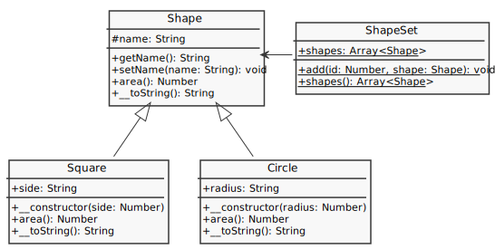
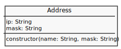

# [Object](http://php.net/manual/en/language.oop5.php)

- [Property](#property)
- [Methods](#methods)
- [Visibility](#visibility)
- [Static keyword](#static-keyword)
- [Object Inheritance](#object-inheritance)
- [Abstract Class](#abstract-class)
- [Interface](#interface)
- [Traits](#traits)
- [Object Array Interaction](#object-array-interaction)

## [Property](http://php.net/manual/en/language.oop5.properties.php)

---


```php

```

## [Methods](http://php.net/manual/en/language.oop5.basic.php#language.oop5.basic.properties-methods)

---


```php

```

## [Visibility](http://php.net/manual/en/language.oop5.visibility.php)

---

<!-- https://www.uml-diagrams.org/visibility.html -->

Visibility: `public (+)`, `protected (#)`, `private (-)`


```php

```

## [Static keyword](http://php.net/manual/en/language.oop5.static.php)

---


Scope Resolution Operator (::) - a token that allows access to static, constant, and overridden properties or methods of a class.

```php

```

## [Object Inheritance](http://php.net/manual/en/language.oop5.inheritance.php)

---


```php

```

## [Abstract Class](https://www.php.net/manual/en/language.oop5.abstract.php)

---



```php

```

## [Interface](https://www.php.net/manual/en/language.oop5.interfaces.php)

---


```php

```

### [Traits](http://php.net/manual/en/language.oop5.traits.php)

---


```php

```

## Object Array Interaction

---



```php

```
