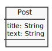
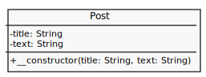
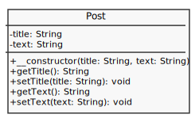
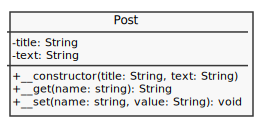
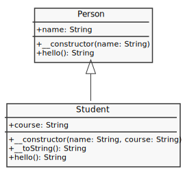
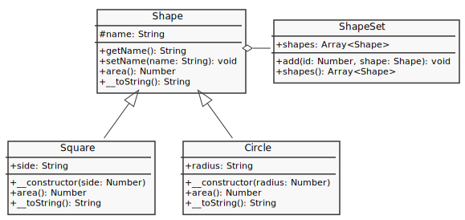
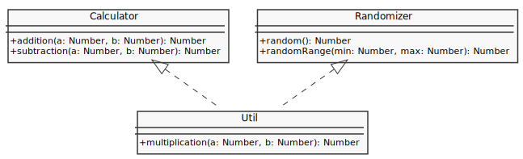
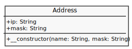

# [Object](http://php.net/manual/en/language.oop5.php)

- [Property](#property)
- [Methods](#methods)
- [Visibility](#visibility)
- [Static keyword](#static-keyword)
- [Object Inheritance](#object-inheritance)
- [Abstract Class](#abstract-class)
- [Interface](#interface)
- [Traits](#traits)
- [Object Array Interaction](#object-array-interaction)

## [Property](http://php.net/manual/en/language.oop5.properties.php)

---



```php

```

Tips:

- The use of `$this` is required to access properties.
- Old style constructors (name of the class) are DEPRECATED in PHP 7.0, and will be removed in a future version. You should always use `__construct()` in new code.
- PHP 5 introduces a destructor concept similar to that of other object-oriented languages, such as C++.

## [Methods](http://php.net/manual/en/language.oop5.basic.php#language.oop5.basic.properties-methods)

---


```php

```

## [Visibility](http://php.net/manual/en/language.oop5.visibility.php)

---

[Visibility](https://www.uml-diagrams.org/visibility.html): `public (+)`, `protected (#)`, `private (-)`



```php

```



```php

```



```php

```

Tips:

- [Magic Method](https://www.php.net/manual/en/language.oop5.magic.php): `__construct()`, `__destruct()`, `__call()`, `__callStatic()`, `__get()`, `__set()`, `__isset()`, `__unset()`, `__sleep()`, `__wakeup()`, `__toString()`, `__invoke()`, `__set_state()`, `__clone()`, `__debugInfo()`

## [Static keyword](http://php.net/manual/en/language.oop5.static.php)

---


```php

```

Tips:

- Scope Resolution Operator (::): a token that allows access to static, constant, and overridden properties or methods of a class.
- As of PHP 7.1.0, class constants may be defined as public, private, or protected. Constants declared without any explicit visibility keyword are defined as public.

## [Object Inheritance](http://php.net/manual/en/language.oop5.inheritance.php)

---



```php

```

Tips:

- If you want to run a parent constructor, a call to parent::\_\_construct() within the child constructor is required.

## [Abstract Class](https://www.php.net/manual/en/language.oop5.abstract.php)

---



```php

```

Reference:

- [Prototype Design Patterns (GoF)](https://www.geeksforgeeks.org/prototype-design-pattern/)

## [Interface](https://www.php.net/manual/en/language.oop5.interfaces.php)

---



```php

```

Tips:

- It's possible for interfaces to have constants.

### [Traits](http://php.net/manual/en/language.oop5.traits.php)

---


```php

```

Tips:

- As of PHP 5.4.0, PHP implements a method of code reuse called Traits.
- Traits are a mechanism for code reuse in single inheritance languages such as PHP.
- Multiple Traits can be inserted into a class by listing them in the use statement, separated by commas.
- Traits support the use of abstract methods in order to impose requirements upon the exhibiting class.
- Traits can define both static members and static methods.
- Traits can also define properties.

## Object Array Interaction

---



```php

```

## Reference

---

- [Classes and Objects](https://www.php.net/manual/en/language.oop5.php)
  - [Final Keyworkd](https://www.php.net/manual/en/language.oop5.final.php)
  - [OOP Changelog](https://www.php.net/manual/en/language.oop5.changelog.php)
  - [Predefined Interfaces and Classes](https://www.php.net/manual/en/reserved.interfaces.php)
  - [Predefined Classes](https://www.php.net/manual/en/reserved.classes.php)
  - [Predefined SPL Interfaces](https://www.php.net/manual/en/spl.interfaces.php)

<!-- TODO
- Trait (Precedence, Conflict Resolution, Changing Method Visibility, Traits Composed from Traits)
- Overloading
-->
