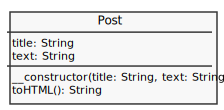
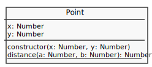
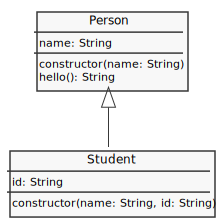
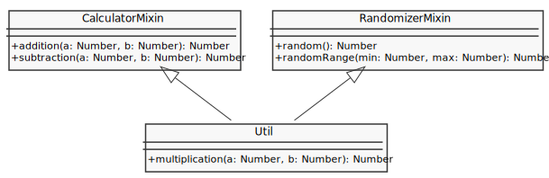

# [Object](http://php.net/manual/en/language.oop5.php)

- [Property](#property)
- [Methods](#methods)
- [Visibility](#visibility)
- [Static keyword](#static-keyword)
- [Object Inheritance](#object-inheritance)
- [Traits](#traits)
- [Object Array Interaction](#object-array-interaction)

## [Property](http://php.net/manual/en/language.oop5.properties.php)

---


```php
class Post {
  public $title;
  public $text;

  public function __construct($title, $text){
    $this->title = $title;
    $this->text = $text;
  }
}

$post = new Post('Lorem ipsum dolor', 'Nunc accumsan in ipsum a mattis...');
var_dump($post);
//=>
// object(Post)#1 (2) {
//   ["title"] => string(17) "Lorem ipsum dolor"
//   ["text"]  => string(34) "Nunc accumsan in ipsum a mattis..."
// }
```

## [Methods](http://php.net/manual/en/language.oop5.basic.php#language.oop5.basic.properties-methods)

---



```php
class Post {
  public $title;
  public $text;

  public function __construct($title, $text){
    $this->title = $title;
    $this->text = $text;
  }

  public function toHMTL(){
    return "<div><h1>$this->title</h1><p>$this->text</p></div>";
  }
}

$post = new Post('Lorem ipsum dolor', 'Nunc accumsan in ipsum a mattis...');
var_dump($post->toHMTL()); //=> string(78) "<div><h1>Lorem ipsum dolor</h1><p>Nunc accumsan in ipsum a mattis...</p></div>"
```

## [Visibility](http://php.net/manual/en/language.oop5.visibility.php)

---

Visibility: `public`, `protected`, `private`

```php
class Post {
  private $title;
  private $text;

  public function __construct($title, $text){
    $this->title = $title;
    $this->text = $text;
  }

  public function getTitle(){
    return $this->title;
  }

  public function setTitle($title){
    $this->title = $title;
  }

  public function getText(){
    return $this->text;
  }

  public function setText($text){
    $this->text = $text;
  }
}

$post = new Post('Lorem ipsum dolor', 'Nunc accumsan in ipsum a mattis...');
$post->setTitle('Dolor');
$title = $post->getTitle();
var_dump($title);   //=> string(5) "Dolor"
$post->title;       //=> Fatal error: Uncaught Error: Cannot access private property Post::$title
```

## [Static keyword](http://php.net/manual/en/language.oop5.static.php)

---



```php
class Point {
  public $x;
  public $y;

  public function __construct($x, $y) {
    $this->x = $x;
    $this->y = $y;
  }

  public static function distance($a, $b) {
    $dx = $a->x - $b->x;
    $dy = $a->y - $b->y;
    return sqrt($dx**2 + $dy**2);
  }
}

$p1 = new Point(5, 5);
$p2 = new Point(10, 10);

var_dump(Point::distance($p1, $p2)); //=> float(7.0710678118655)
```

## [Object Inheritance](http://php.net/manual/en/language.oop5.inheritance.php)

---



```php
class Person {
  public function __construct($name) {
    $this->name = $name;
  }

  public function hello(){
    return "Hello: {$this->name}";
  }
}

class Student extends Person {
  public function __construct($name, $id){
    parent::__construct($name);
    $this->id = $id;
  }
}

$student = new Student('fulano', 10);

var_dump($student->hello()); //=> string(20) tring(13) "Hello: fulano"
```

### [Traits](http://php.net/manual/en/language.oop5.traits.php)

---



```php
trait CalculatorMixin {
  public function addition($a, $b) {
    return $a + $b;
  }

  public function subtraction($a, $b) {
    return $a - $b;
  }
}

trait RandomizerMixin {
  public function random() {
    return rand();
  }

  public function randomRange($min, $max) {
    return rand($min, $max);
  }
}

class Util {
  use CalculatorMixin, RandomizerMixin;

  public function multiplication($a, $b) {
    return $a * $b;
  }
}

$util = new Util();

var_dump($util->randomRange(1,10));   //=> int(5)
var_dump($util->subtraction(100,10)); //=> int(90)
```

## Object Array Interaction

---

```js
class Address {
  function __construct($ip, $mask) {
    $this->ip = $ip;
    $this->mask = $mask;
  }
}

$ips = [
  new Address("192.168.0.2", "255.255.255.0"),
  new Address("192.168.0.10", "255.255.255.0"),
  new Address("192.168.0.26", "255.255.255.0"),
  new Address("192.168.0.30", "255.255.255.0")
];

foreach($ips as $ip){
  print("{$ip->ip}/{$ip->mask}\n");
}
//=>
// 192.168.0.2/255.255.255.0
// 192.168.0.10/255.255.255.0
// 192.168.0.26/255.255.255.0
// 192.168.0.30/255.255.255.0
```
