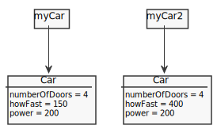
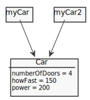
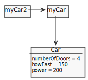

# [References](http://php.net/manual/en/language.references.php)

- [Scalar Types](#scalar-types)
  - [Passing by value (Assignment)](#passing-by-value-assignment)
  - [Passing by value (Function)](#passing-by-value-function)
  - [Passing by reference (Assignment)](#passing-by-reference-assignment)
  - [Passing by reference (Function)](#passing-by-reference-function)
- [Compound Types (Array)](#compound-types-array)
  - [Passing by value (Assignment)](#passing-by-value-assignment)
  - [Passing by reference (Assignment)](#passing-by-reference-assignment)
- [Compound Types (Object)](#compound-types-object)
  - [Passing by value with clone (Assignment)](#passing-by-value-with-clone-assignment)
  - [Passing by reference of identifier (Assignment)](#passing-by-reference-of-identifier-assignment)
  - [Passing by reference of value (Assignment)](#passing-by-reference-of-value-assignment)
  - [Passing by value (Statement - foreach)](#passing-by-value-statement---foreach)
  - [Passing by reference (Statement - foreach)](#passing-by-reference-statement---foreach)

## Scalar Types

### Passing by value (Assignment)

```php
$name1 = "test";
var_dump($name1); //=> string(4) "test"

// Passing by value
$name2 = $name1;
$name2 = "new test";
var_dump($name1); //=> string(4) "test"
var_dump($name2); //=> string(10) "new test"
```

### Passing by value (Function)

```php
$num = 10;
function plusOne($a) {
  return ++$a;
}
var_dump($num);          //=> int(10)
var_dump(plusOne($num)); //=> int(11)
var_dump($num);          //=> int(10)
```

### Passing by reference (Assignment)

```php
$name1 = "test";
var_dump($name1); //=> string(4) "test"

// Passing by reference
$name2 = &$name1;
$name2 = "final test";
var_dump($name1); //=> string(10) "final test"
var_dump($name2); //=> string(10) "final test"
```

```php
$name1 = "test";
var_dump($name1); //=> string(4) "test"

// Passing by reference
$name2 = &$name1;
$name2 = null;
var_dump($name1); //=> NULL
var_dump($name2); //=> NULL
```

### Passing by reference (Function)

```php
$num = 10;
function plusOne(&$a) {
  return ++$a;
}
var_dump($num);          //=> int(10)
var_dump(plusOne($num)); //=> int(11)
var_dump($num);          //=> int(11)
```

## Compound Types (Array)

### Passing by value (Assignment)

```php
$person = ['name' => 'fulano', 'email' => 'fulano@email'];

// Passing by value
$person2 = $person;
$person2['name'] = 'sicrano';
echo $person['name']; //=> fulano
```

### Passing by reference (Assignment)

```php
$person = ['name' => 'fulano', 'email' => 'fulano@email'];

// Passing by reference
$person2 = &$person;
$person2['name'] = 'sicrano';
echo $person['name']; //=> sicrano
```

```php
$person = ['name' => 'fulano', 'email' => 'fulano@email'];

// Passing by reference
$person2 = &$person;
$person2 = null;
var_dump($person);  //=> NULL
var_dump($person2); //=> NULL
```

## Compound Types (Object)

### Passing by value with clone (Assignment)

```php
class Car {
  public $numberOfDoors;
  public $howFast;
}

$myCar = new Car();
$myCar->numberOfDoors = 4;
$myCar->howFast = 150;
$myCar->power = 200;
print_r($myCar);
//=>
// Car Object
// (
//   [numberOfDoors] => 4
//   [howFast] => 150
//   [power] => 200
// )

$myCar2 = clone $myCar;
$myCar2->howFast = 400;
print_r($myCar);
//=>
// Car Object
// (
//   [numberOfDoors] => 4
//   [howFast] => 150
//   [power] => 200
// )
```



### Passing by reference of identifier (Assignment)

```php
$myCar = new stdClass;
$myCar->numberOfDoors = 4;
$myCar->howFast = 150;
print_r($myCar);
//=>
// stdClass Object
// (
//  [numberOfDoors] => 4
//  [howFast] => 150
// )

$myCar2 = $myCar;
$myCar2->power = 110;
print_r($myCar);
//=>
// stdClass Object
// (
//  [numberOfDoors] => 4
//  [howFast] => 150
//  [power] => 110
// )
```



```php
$myCar = new stdClass;
$myCar->numberOfDoors = 4;
$myCar->howFast = 150;

$myCar2 = $myCar;
$myCar2->power = 110;

$myCar = null;
print_r($myCar2);
//=>
// stdClass Object
// (
//  [numberOfDoors] => 4
//  [howFast] => 150
//  [power] => 110
// )
```

### Passing by reference of value (Assignment)

```php
$myCar = new stdClass;
$myCar->numberOfDoors = 4;
$myCar->howFast = 150;
print_r($myCar);
//=>
// stdClass Object
// (
//  [numberOfDoors] => 4
//  [howFast] => 150
// )

$myCar2 = &$myCar;
$myCar2->power = 110;
print_r($myCar);
//=>
// stdClass Object
// (
//  [numberOfDoors] => 4
//  [howFast] => 150
//  [power] => 110
// )
```



```php
$myCar = new stdClass;
$myCar->numberOfDoors = 4;
$myCar->howFast = 150;

$myCar2 = &$myCar;
$myCar2->power = 110;

$myCar = null;
var_dump($myCar2); //=> NULL
```

### Passing by value (Statement - foreach)

```php
$names = [0 => fulano, 'admin' => sicrano, 'client' => beltrano];

foreach($names as $key=>$name){
  $name .= 'sufix';
}
print_r($names);
//=>
// Array
// (
//   [0] => fulano
//   [admin] => sicrano
//   [client] => beltrano
// )
```

### Passing by reference (Statement - foreach)

```php
$names = [0 => fulano, 'admin' => sicrano, 'client' => beltrano];

foreach($names as $key=>&$name){
  $name .= 'sufix';
}
print_r($names);
//=>
// Array
// (
//   [0] => fulanosufix
//   [admin] => sicranosufix
//   [client] => beltranosufix
// )
```

## References

- [References Explained](https://www.php.net/manual/en/language.references.php)
- [Objects and references](https://www.php.net/manual/en/language.oop5.references.php)
