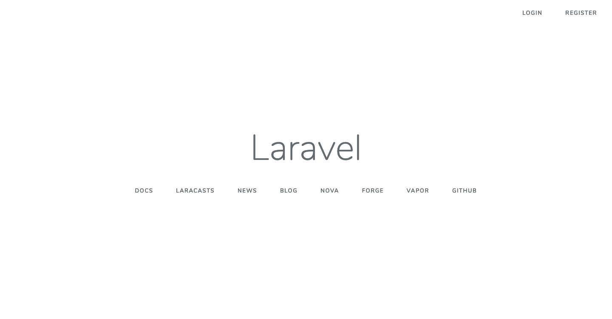
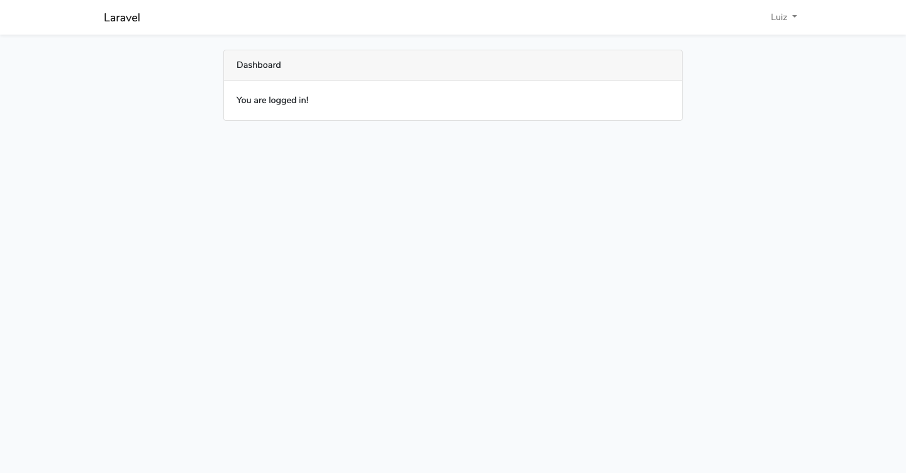
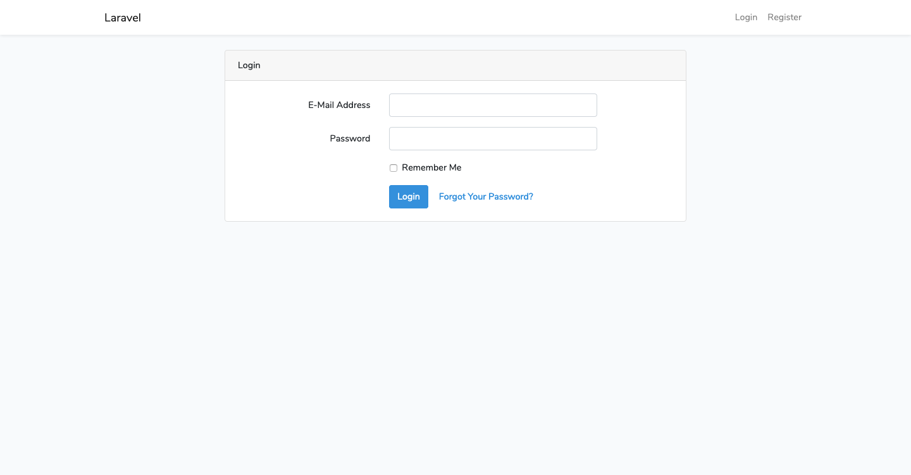
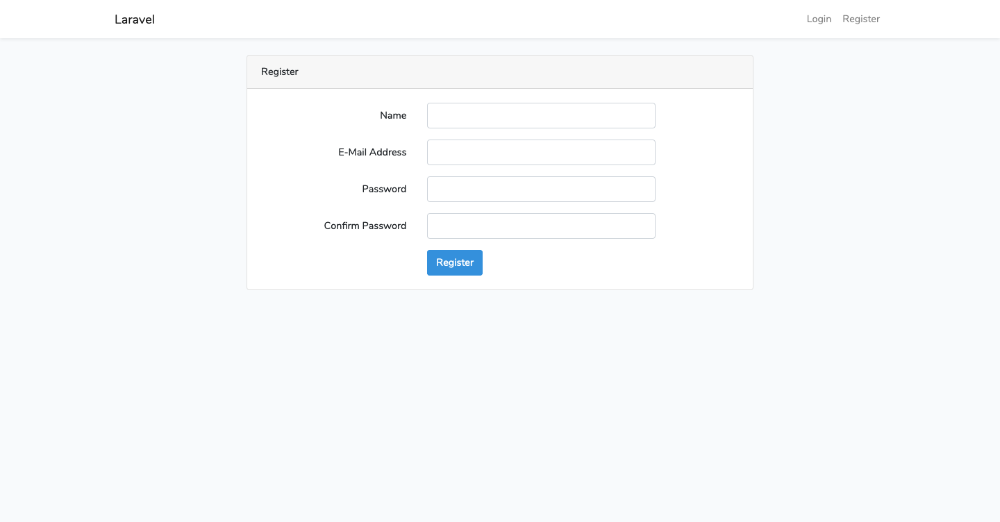
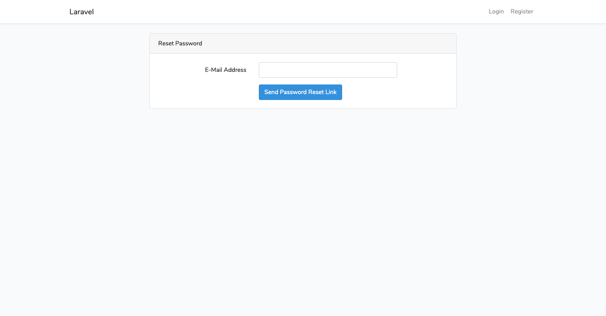

# Authentication

- [Quickstart](#quickstart)
- [Routes](#routes)
- [Controllers](#controllers)
- [Views](#views)

## Quickstart

---

> Migration:

```
$ docker-compose exec php sh
# php artisan migrate
Migration table created successfully.
Migrating: 2014_10_12_000000_create_users_table
Migrated:  2014_10_12_000000_create_users_table (0.25 seconds)
Migrating: 2014_10_12_100000_create_password_resets_table
Migrated:  2014_10_12_100000_create_password_resets_table (0.2 seconds)
Migrating: 2019_08_19_000000_create_failed_jobs_table
Migrated:  2019_08_19_000000_create_failed_jobs_table (0.11 seconds)
```

> laravel/ui:

```
# composer require laravel/ui --dev
Using version ^1.1 for laravel/ui
./composer.json has been updated
Loading composer repositories with package information
Updating dependencies (including require-dev)
Package operations: 1 install, 0 updates, 0 removals
  - Installing laravel/ui (v1.1.1): Downloading (100%)
Writing lock file
Generating optimized autoload files
> Illuminate\Foundation\ComposerScripts::postAutoloadDump
> @php artisan package:discover --ansi
Discovered Package: facade/ignition
Discovered Package: fideloper/proxy
Discovered Package: laravel/tinker
Discovered Package: laravel/ui
Discovered Package: nesbot/carbon
Discovered Package: nunomaduro/collision
Package manifest generated successfully.
```

> scaffolding bootstrap auth:

```
# php artisan ui bootstrap --auth
Bootstrap scaffolding installed successfully.
Please run "npm install && npm run dev" to compile your fresh scaffolding.
Authentication scaffolding generated successfully.
```

> build front:

```
# npm install && npm run dev
npm notice created a lockfile as package-lock.json. You should commit this file.
npm WARN optional SKIPPING OPTIONAL DEPENDENCY: fsevents@1.2.11 (node_modules/fsevents):
npm WARN notsup SKIPPING OPTIONAL DEPENDENCY: Unsupported platform for fsevents@1.2.11: wanted {"os":"darwin","arch":"any"} (current: {"os":"linux","arch":"x64"})

added 1008 packages from 489 contributors and audited 17218 packages in 164.81s
found 0 vulnerabilities


> @ dev /var/www
> npm run development


> @ development /var/www
> cross-env NODE_ENV=development node_modules/webpack/bin/webpack.js --progress --hide-modules --config=node_modules/laravel-mix/setup/webpack.config.js

        Additional dependencies must be installed. This will only take a moment.

        Running: npm install vue-template-compiler --save-dev --production=false

npm WARN optional SKIPPING OPTIONAL DEPENDENCY: fsevents@1.2.11 (node_modules/fsevents):
npm WARN notsup SKIPPING OPTIONAL DEPENDENCY: Unsupported platform for fsevents@1.2.11: wanted {"os":"darwin","arch":"any"} (current: {"os":"linux","arch":"x64"})

        Okay, done. The following packages have been installed and saved to your package.json dependencies list:

        - vue-template-compiler

98% after emitting SizeLimitsPlugin

 DONE  Compiled successfully in 35900ms                                                                                                          5:03:00 PM

       Asset      Size   Chunks             Chunk Names
/css/app.css   196 KiB  /js/app  [emitted]  /js/app
  /js/app.js  1.06 MiB  /js/app  [emitted]  /js/app
```

## Routes

---

```
# php artisan route:list
+--------+----------+------------------------+------------------+------------------------------------------------------------------------+--------------+
| Domain | Method   | URI                    | Name             | Action                                                                 | Middleware   |
+--------+----------+------------------------+------------------+------------------------------------------------------------------------+--------------+
|        | GET|HEAD | /                      |                  | Closure                                                                | web          |
|        | GET|HEAD | api/user               |                  | Closure                                                                | api,auth:api |
|        | GET|HEAD | home                   | home             | App\Http\Controllers\HomeController@index                              | web,auth     |
|        | GET|HEAD | login                  | login            | App\Http\Controllers\Auth\LoginController@showLoginForm                | web,guest    |
|        | POST     | login                  |                  | App\Http\Controllers\Auth\LoginController@login                        | web,guest    |
|        | POST     | logout                 | logout           | App\Http\Controllers\Auth\LoginController@logout                       | web          |
|        | GET|HEAD | password/confirm       | password.confirm | App\Http\Controllers\Auth\ConfirmPasswordController@showConfirmForm    | web,auth     |
|        | POST     | password/confirm       |                  | App\Http\Controllers\Auth\ConfirmPasswordController@confirm            | web,auth     |
|        | POST     | password/email         | password.email   | App\Http\Controllers\Auth\ForgotPasswordController@sendResetLinkEmail  | web          |
|        | GET|HEAD | password/reset         | password.request | App\Http\Controllers\Auth\ForgotPasswordController@showLinkRequestForm | web          |
|        | POST     | password/reset         | password.update  | App\Http\Controllers\Auth\ResetPasswordController@reset                | web          |
|        | GET|HEAD | password/reset/{token} | password.reset   | App\Http\Controllers\Auth\ResetPasswordController@showResetForm        | web          |
|        | GET|HEAD | register               | register         | App\Http\Controllers\Auth\RegisterController@showRegistrationForm      | web,guest    |
|        | POST     | register               |                  | App\Http\Controllers\Auth\RegisterController@register                  | web,guest    |
+--------+----------+------------------------+------------------+------------------------------------------------------------------------+--------------+
```

> Route Groups (Middleware):

```
Route::middleware(['auth'])->group(function () {
    Route::resource('alumni', 'AlumniController')->only([
        'create', 'store', 'edit', 'update', 'destroy'
    ]);
});
```

## Controllers

---

> `app/Http/Controllers/`:

```
.
├── Auth
│   ├── ConfirmPasswordController.php
│   ├── ForgotPasswordController.php
│   ├── LoginController.php
│   ├── RegisterController.php
│   ├── ResetPasswordController.php
│   └── VerificationController.php
├── Controller.php
└── HomeController.php
```

## Views

---

> `resources/views/`:

```
├── auth
│   ├── login.blade.php
│   ├── passwords
│   │   ├── confirm.blade.php
│   │   ├── email.blade.php
│   │   └── reset.blade.php
│   ├── register.blade.php
│   └── verify.blade.php
├── home.blade.php
├── layouts
│   └── app.blade.php
└── welcome.blade.php
```

`Directives`:

- `@auth`
- `@guest`

`Illuminate\Auth`:

- `Auth::user()`
- `Auth::id()`
- `Auth::check()`
- `Auth::login()`
- `Auth::logout()`

> `resources/views/welcome.blade.php`:



```php

@if (Route::has('login'))
    <div class="top-right links">
        @auth
            <a href="{{ url('/home') }}">Home</a>
        @else
            <a href="{{ route('login') }}">Login</a>

            @if (Route::has('register'))
                <a href="{{ route('register') }}">Register</a>
            @endif
        @endauth
    </div>
@endif

```

> `resources/views/layouts/app.blade.php`:

```php

<nav class="navbar navbar-expand-md navbar-light bg-white shadow-sm">
    <div class="container">
        <a class="navbar-brand" href="{{ url('/') }}">
            {{ config('app.name', 'Laravel') }}
        </a>
        <button class="navbar-toggler" type="button" data-toggle="collapse" data-target="#navbarSupportedContent" aria-controls="navbarSupportedContent" aria-expanded="false" aria-label="{{ __('Toggle navigation') }}">
            <span class="navbar-toggler-icon"></span>
        </button>

        <div class="collapse navbar-collapse" id="navbarSupportedContent">
            <!-- Left Side Of Navbar -->
            <ul class="navbar-nav mr-auto">

            </ul>

            <!-- Right Side Of Navbar -->
            <ul class="navbar-nav ml-auto">
                <!-- Authentication Links -->
                @guest
                    <li class="nav-item">
                        <a class="nav-link" href="{{ route('login') }}">{{ __('Login') }}</a>
                    </li>
                    @if (Route::has('register'))
                        <li class="nav-item">
                            <a class="nav-link" href="{{ route('register') }}">{{ __('Register') }}</a>
                        </li>
                    @endif
                @else
                    <li class="nav-item dropdown">
                        <a id="navbarDropdown" class="nav-link dropdown-toggle" href="#" role="button" data-toggle="dropdown" aria-haspopup="true" aria-expanded="false" v-pre>
                            {{ Auth::user()->name }} <span class="caret"></span>
                        </a>

                        <div class="dropdown-menu dropdown-menu-right" aria-labelledby="navbarDropdown">
                            <a class="dropdown-item" href="{{ route('logout') }}"
                                onclick="event.preventDefault();
                                              document.getElementById('logout-form').submit();">
                                {{ __('Logout') }}
                            </a>

                            <form id="logout-form" action="{{ route('logout') }}" method="POST" style="display: none;">
                                @csrf
                            </form>
                        </div>
                    </li>
                @endguest
            </ul>
        </div>
    </div>
</nav>

```

> `resources/views/home.blade.php`:



```php

@extends('layouts.app')

@section('content')
<div class="container">
    <div class="row justify-content-center">
        <div class="col-md-8">
            <div class="card">
                <div class="card-header">Dashboard</div>

                <div class="card-body">
                    @if (session('status'))
                        <div class="alert alert-success" role="alert">
                            {{ session('status') }}
                        </div>
                    @endif

                    You are logged in!
                </div>
            </div>
        </div>
    </div>
</div>
@endsection

```

> `resources/views/auth/login.blade.php`:



```php

@extends('layouts.app')

@section('content')
<div class="container">
    <div class="row justify-content-center">
        <div class="col-md-8">
            <div class="card">
                <div class="card-header">{{ __('Login') }}</div>

                <div class="card-body">
                    <form method="POST" action="{{ route('login') }}">
                        @csrf

                        <div class="form-group row">
                            <label for="email" class="col-md-4 col-form-label text-md-right">{{ __('E-Mail Address') }}</label>

                            <div class="col-md-6">
                                <input id="email" type="email" class="form-control @error('email') is-invalid @enderror" name="email" value="{{ old('email') }}" required autocomplete="email" autofocus>

                                @error('email')
                                    <span class="invalid-feedback" role="alert">
                                        <strong>{{ $message }}</strong>
                                    </span>
                                @enderror
                            </div>
                        </div>

                        <div class="form-group row">
                            <label for="password" class="col-md-4 col-form-label text-md-right">{{ __('Password') }}</label>

                            <div class="col-md-6">
                                <input id="password" type="password" class="form-control @error('password') is-invalid @enderror" name="password" required autocomplete="current-password">

                                @error('password')
                                    <span class="invalid-feedback" role="alert">
                                        <strong>{{ $message }}</strong>
                                    </span>
                                @enderror
                            </div>
                        </div>

                        <div class="form-group row">
                            <div class="col-md-6 offset-md-4">
                                <div class="form-check">
                                    <input class="form-check-input" type="checkbox" name="remember" id="remember" {{ old('remember') ? 'checked' : '' }}>

                                    <label class="form-check-label" for="remember">
                                        {{ __('Remember Me') }}
                                    </label>
                                </div>
                            </div>
                        </div>

                        <div class="form-group row mb-0">
                            <div class="col-md-8 offset-md-4">
                                <button type="submit" class="btn btn-primary">
                                    {{ __('Login') }}
                                </button>

                                @if (Route::has('password.request'))
                                    <a class="btn btn-link" href="{{ route('password.request') }}">
                                        {{ __('Forgot Your Password?') }}
                                    </a>
                                @endif
                            </div>
                        </div>
                    </form>
                </div>
            </div>
        </div>
    </div>
</div>
@endsection

```

> `resources/views/auth/register.blade.php`:



> `resources/views/auth/reset.blade.php`:



## References

---

- [Laravel Doc](https://laravel.com/docs/6.x)
  - [JavaScript & CSS Scaffolding](https://laravel.com/docs/6.x/frontend)
  - [Authentication](https://laravel.com/docs/6.x/authentication)
  - [Localization](https://laravel.com/docs/6.x/localization)
  - [Route Groups (Middleware)](https://laravel.com/docs/6.x/routing#route-group-middleware)
- [Laravel 6 Auth Tutorial: Login/Register/Password Reset UI](https://www.techiediaries.com/laravel-authentication-tutorial/)
- [Laravel 6 Multi Auth (Authentication) Tutorial](https://www.itsolutionstuff.com/post/laravel-6-multi-auth-authentication-tutorialexample.html)
- [php artisan make:auth in laravel 6.0](https://dev.to/msamgan/php-artisan-make-auth-in-laravel-6-0-hc)
- [Running make:auth in Laravel 6](https://laravel-news.com/running-make-auth-in-laravel-6)
- [LARAVEL 6.0 intro to new Laravel Authentication](https://www.youtube.com/watch?v=zEPYSNO7o3Q)
- [Default Login/Register/Auth process in Laravel 6 \| Install laravel/ui package \| Update UI Design](https://www.youtube.com/watch?v=GWl5-VLCiJA)
