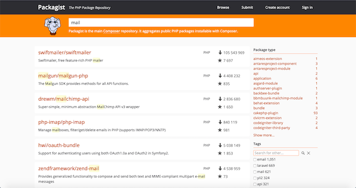

# Packagist

- [Architecture](#architecture)
- [Website](#website)
- [Registry](#registry)
- [Composer (CLI)](#composer-cli)

## Architecture

---

### Package Managers

- [https://libraries.io/](https://libraries.io/)
  - [Packagist (PHP)](https://packagist.org/)
  - [NPM (Javascript)](https://www.npmjs.com/)
  - [PyPI (Python)](https://pypi.org/)

### Components

```
┌────────────┐  ┌────────────┐  ┌─────────┐
│  Website   │  │  Registry  │  │   CLI   │
└────────────┘  └────────────┘  └─────────┘
```

## Website

---

[https://packagist.org/?query=mail](https://packagist.org/?query=mail):


## Registry

---

### Packagist Public Registry

```
    Packages                              Projects
                                         ┌─────────────────┐
                                         │ Project A       │
┌───────────────┐                        │┌───────────────┐│
│reuseble-code-x├─┐                  ┌──▶││reuseble-code-x││
└───────────────┘ │   ╭───────────╮  │   │└───────────────┘│
┌───────────────┐ │   │   Public  │  │   └─────────────────┘
│reuseble-code-y├─┼──▶│  Registry ├──┤   ┌─────────────────┐
└───────────────┘ │   │(Packagist)│  │   │ Project B       │
┌───────────────┐ │   ╰───────────╯  │   │┌───────────────┐│
│reuseble-code-z├─┘                  ├──▶││reuseble-code-y││
└───────────────┘                    │   │└───────────────┘│
                                     │   │┌───────────────┐│
                                     └──▶││reuseble-code-z││
                                         │└───────────────┘│
                                         └─────────────────┘
```

### Create a Package

```
 reuseble-code
┌───────────────┐
│ lib.php        │
│ composer.json │
└───────────────┘
```

**composer.json**:

```js
{
  "name": "reuseble-code",
  "version": "1.0.0"
}
```

## [Composer (CLI)](https://getcomposer.org)

---

### Installation - Linux / Unix / macOS

[Downloading the Composer Executable](https://getcomposer.org/doc/00-intro.md#downloading-the-composer-executable)

```
$ php -r "copy('https://getcomposer.org/composer.phar', 'composer.phar');"
$ mv composer.phar ~/.local/bin/composer
```

### Publish/Install Package

- [Publishing package to Packagist](https://github.com/CurrencyCloud/currencycloud-php/wiki/Publishing-package-to-Packagist)

```
                                                           ┌────────────────────────────────┐
                                     ╭───────────╮    ┌───▶│$ composer require reuseble-code│
┌────────────────────────────────┐   │ Public    │    │    └────────────────────────────────┘
│publish reuseble-code (form web)├──▶│Registry   ├────┤
└────────────────────────────────┘   │(packagist)│    │    ┌────────────────────────────────┐
                                     ╰───────────╯    └───▶│$ composer require reuseble-code│
                                                           └────────────────────────────────┘
```

### Specifying Dependencies

[phpmailer/phpmailer](https://packagist.org/packages/phpmailer/phpmailer):

```
$ mkdir project
$ cd project
$ composer require phpmailer/phpmailer
```

```
$ tree . -I vendor
.
├── composer.json
└── composer.lock
```

**composer.json**:

```js
{
  "require": {
    "phpmailer/phpmailer": "~6.0"
  }
}
```

**show packages**:

```
$ composer show -i
```

**install packages**:

```
$ rm composer.lock
$ rm -rf vendor
$ composer install
```

### Specifying devDependencies

[kahlan](https://packagist.org/packages/kahlan/kahlan):

```
$ mkdir project
$ cd project
$ composer require kahlan/kahlan --dev
```

**composer.json**:

```js
{
  "require-dev": {
    "kahlan/kahlan": "^4.1"
  }
}
```

**Running kahlan**:

```
$ php vendor/bin/kahlan --spec=folder/to/spec/
```

### Specifying multiples devDependencies

[phpmailer/phpmailer](https://packagist.org/packages/phpmailer/phpmailer) & [psr/log](https://packagist.org/packages/psr/log):

```
$ mkdir project
$ cd project
$ composer require phpmailer/phpmailer psr/log
```

**composer.json**:

```js
{
  "require": {
    "phpmailer/phpmailer": "~6.0"
    "psr/log": "~1.0"
  }
}
```
