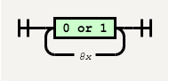
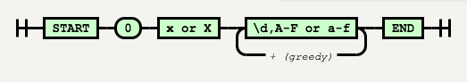
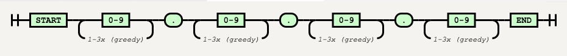
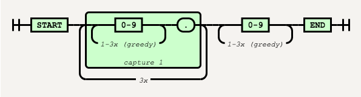

# Patterns

* [Byte](#byte)
* [Hexa Number](#hexa-number)
* [IP](#ip)

## Byte
---

### /[01]{8}/



```php
$pattern = "/[01]{8}/";
var_dump(preg_match($pattern, '01010101'));  //=> int(1)
var_dump(preg_match($pattern, '11110000'));  //=> int(1)
var_dump(preg_match($pattern, '11110002'));  //=> int(0)
```

## Hexa Number
---

### /^0[xX][\dA-Fa-f]+$/



```js
$pattern = "/^0[xX][\dA-Fa-f]+$/";
var_dump(preg_match($pattern, '0x1f'));       //=> int(1)
var_dump(preg_match($pattern, '0x1F'));       //=> int(1)
var_dump(preg_match($pattern, '0X1f'));       //=> int(1)
var_dump(preg_match($pattern, '0X1FFFF'));    //=> int(1)
var_dump(preg_match($pattern, '01FFFF'));     //=> int(0)
```

## IP
---

### /^\d{1,3}\.\d{1,3}\.\d{1,3}\.\d{1,3}$/



```js
$pattern = "/^\d{1,3}\.\d{1,3}\.\d{1,3}\.\d{1,3}$/";
var_dump(preg_match($pattern, '255.255.255.255')); //=> int(1)
var_dump(preg_match($pattern, '192.168.0.1'));     //=> int(1)
var_dump(preg_match($pattern, '10.0.24.1'));       //=> int(1)
var_dump(preg_match($pattern, '8.8.8.8'));         //=> int(1)
var_dump(preg_match($pattern, '300.8.8.8'));       //=> int(1)
```

### /^(\d{1,3}\.){3}\d{1,3}$/


```js
$pattern = "/^(\d{1,3}\.){3}\d{1,3}$/";
var_dump(preg_match($pattern, '255.255.255.255'));  //=> int(1)
var_dump(preg_match($pattern, '192.168.0.1'));      //=> int(1)
var_dump(preg_match($pattern, '10.0.24.1'));        //=> int(1)
var_dump(preg_match($pattern, '8.8.8.8'));          //=> int(1)
```