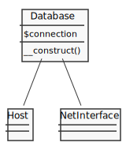
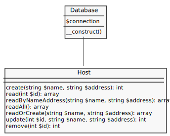
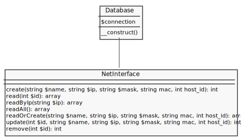

# Host Interfaces Model

- [Code](#code)
- [Database](#database)
- [Install](#install)
- [PDO Model](#pdo-moodel)
  - [Database Model](#database-model)
  - [Host Model](#host-model)
  - [Interface Model](#interface-model)
- [How to CRUD](#how-to-crud)

## Code

---

```
host-interface
├── .env
├── Dockerfile
├── database
│   ├── config.php
│   ├── database.php
│   ├── schema.mwb
│   └── schema.sql
├── docker-compose.yml
├── install
│   └── index.php
├── model
│   ├── host.php
│   └── interface.php
└── test.php
```

> [docker-compose.yml](docker-compose.yml):

```

```

> [Dockerfile](Dockerfile):

```

```

> [.env](.env):

```

```

## Database

---


> [database/schema.sql](database/schema.sql):

```sql

```

## Install

---

> [install/index.php](install/index.php):

```php

```

> [database/config.php](database/config.php):

```php

```

> [http://localhost:8080/install/](http://localhost:8080/install/)

## PDO Model

---

### Database Model



> [database/database.php](database/database.php):

```php

```

### Host Model



> [model/host.php](model/host.php):

```php

```

### Interface Model



> [model/interface.php](model/interface.php):

```php

```

## How to CRUD

---

> [test.php](test.php):

```php

```

> [http://localhost:8080/test.php](http://localhost:8080/test.php)
