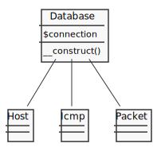
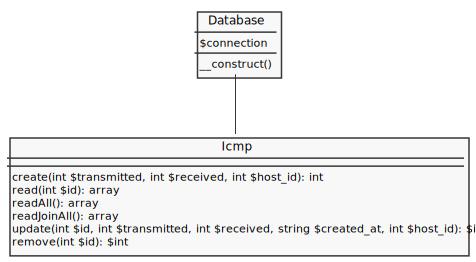
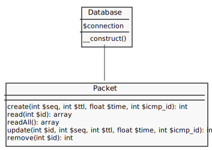

# Ping Model

- [Database](#database)
- [Install](#install)
- [PDO Model](#pdo-moodel)
  - [Database Model](#database-model)
  - [Host Model](#host-model)
  - [ICMP Model](#icmp-model)
  - [Packet Model](#packet-model)
- [How to CRUD](#how-to-crud)

## Database
---


[database/schema.sql](database/schema.sql):
```sql

```

## Install
---

[http://localhost:8080/php/stdlib/pdo/codes/ping/install/](http://localhost:8080/php/stdlib/pdo/codes/ping/install/):
```php

```

[database/config.php](database/config.php):
```php

```

## PDO Model
---

### Database Model



[database/database.php](database/database.php):
```php

```

### Host Model


[model/host.php](model/host.php):
```php

```

### ICMP Model



[model/icmp.php](model/icmp.php):
```php

```

### Packet Model



[model/packet.php](model/packet.php):
```php

```

## How to CRUD
---

[test.php](test.php):
```php

```
