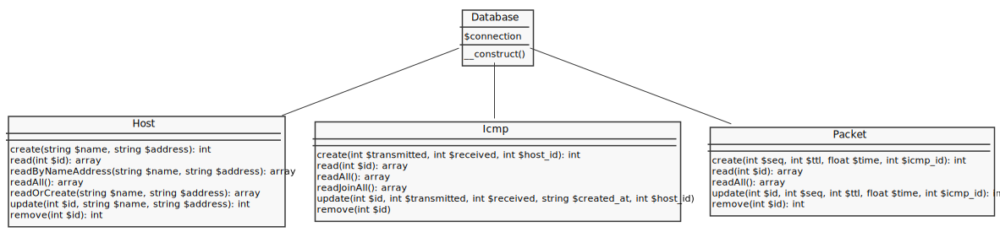

# Ping Model

## Database
---


[database/schema.sql](database/schema.sql):
```sql

```

## Install
---

[http://localhost:8080/php/stdlib/pdo/codes/ping/install/](http://localhost:8080/php/stdlib/pdo/codes/ping/install/):
```php

```

[database/config.php](database/config.php):
```php

```

## CRUD
---



[database/database.php](database/database.php):
```php

```

[model/host.php](model/host.php):
```php

```

[model/icmp.php](model/icmp.php):
```php

```

[model/packet.php](model/packet.php):
```php

```

## Test
---

[test.php](test.php):
```php

```
