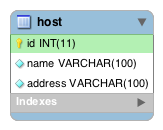

# Host DB API

- [Host Simple Model](#host-simple-model)
- [Services](#services)
  - [Read all hosts](#read-all-hosts)
  - [Read host by id](#read-host-by-id)
  - [Create host](#create-host)
  - [Update host](#update-host)
  - [Remove host](#remove-host)

## [Host Simple Model](https://ifpb.github.io/php-guide/stdlib/pdo/codes/host-simple/)
---



[database/schema.sql](database/schema.sql):
```sql

```

## Services
---

### Read all hosts

```
http://localhost:8080/php/web/web-api/codes/db/host/api/v1/
http://localhost:8080/php/web/web-api/codes/db/host/api/v1/?a=readAll
```

**Example**

[http://localhost:8080/php/web/web-api/codes/db/host/api/v1/?a=readAll](http://localhost:8080/php/web/web-api/codes/db/host/api/v1/?a=readAll)

```json
[
  {
    "id": "1",
    "name": "www.google.com",
    "address": "216.58.222.100"
  }
]
```

### Read host by id

```
http://localhost:8080/php/web/web-api/codes/db/host/api/v1/?a=read&id=:id
```

**Params**

| Name | Type |	Description |
|-|-|-|
| :id	| Integer	| host id |

**Example**

[http://localhost:8080/php/web/web-api/codes/db/host/api/v1/?a=read&id=1](http://localhost:8080/php/web/web-api/codes/db/host/api/v1/?a=read&id=1)

```json
{
  "id": "1",
  "name": "www.google.com",
  "address": "216.58.222.100"
}
```

### Create host

```
http://localhost:8080/php/web/web-api/codes/db/host/api/v1/?a=create&host=:host&address=:address
```

**Params**

| Name | Type |	Description |
|-|-|-|
| :host	| String	| hostname |
| :address	| String	| IP Address |

**Example**

[http://localhost:8080/php/web/web-api/codes/db/host/api/v1/?a=create&host=www.ifpb.edu.br&address=200.129.77.61](http://localhost:8080/php/web/web-api/codes/db/host/api/v1/?a=create&host=www.ifpb.edu.br&address=200.129.77.61)

```json
{
  "status": "host created."
}
```

### Update host

```
http://localhost:8080/php/web/web-api/codes/db/host/api/v1/?a=update&id=:id&host=:host&address=:address
```

**Params**

| Name | Type |	Description |
|-|-|-|
| :id	| Integer	| host id |
| :host	| String	| hostname |
| :address	| String	| IP Address |

**Example**

[http://localhost:8080/php/web/web-api/codes/db/host/api/v1/?a=update&id=2&host=www.ifpb.edu.br&address=200.129.77.62](http://localhost:8080/php/web/web-api/codes/db/host/api/v1/?a=update&id=2&host=www.ifpb.edu.br&address=200.129.77.62)

```json
{
  "status": "host updated."
}
```

### Remove host

```
http://localhost:8080/php/web/web-api/codes/db/host/api/v1/?a=remove&id=:id
```

**Params**

| Name | Type |	Description |
|-|-|-|
| :id	| Integer	| host id |

**Example**

[http://localhost:8080/php/web/web-api/codes/db/host/api/v1/?a=remove&id=2](http://localhost:8080/php/web/web-api/codes/db/host/api/v1/?a=remove&id=2)

```json
{
  "status": "host removed."
}
```