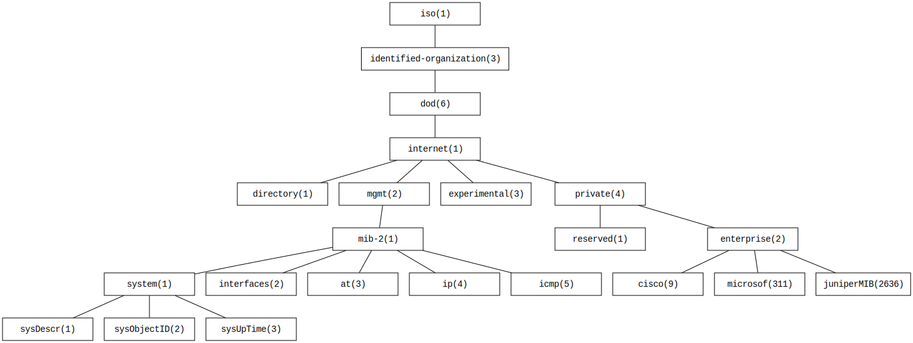

# SNMP API

## Architecture
---

### Configuation


[Vagrantfile](Vagrantfile):
```ruby

```

[install/snmpserver.sh](install/snmpserver.sh):
```sh

```

[install/snmpclient.sh](install/snmpclient.sh):
```sh

```

### MIB



[Object Identifier (OID) - sysUpTime](http://oid-info.com/get/1.3.6.1.2.1.1.3): 
iso(1)>identified-organization(3)>dod(6)>internet(1)>mgmt(2)>mib-2(1)>system(1)>sysUpTime(3) - 1.3.6.1.2.1.1.3
```
$ snmpget -v 2c -cpublic [IP_DO_AGENTE] sysUpTime.0
$ snmpget -v 2c -cpublic [IP_DO_AGENTE] 1.3.6.1.2.1.1.3.0
$ snmpget -v 1  -cpublic [IP_DO_AGENTE] sysUpTime.0
``` 

`snmpget`, `snmpwalk`, `snmpbulkwalk`, `snmptable`, `snmpset`, `snmptrapd` (vagrant@snmpserver):

```
$ snmpwalk -v 2c -c public [IP_DO_AGENTE]
$ snmpwalk -v 2c -c public [IP_DO_AGENTE] sysDescr
$ snmpwalk -v 2c -c public [IP_DO_AGENTE] interface
$ snmpwalk -v 2c -c public [IP_DO_AGENTE] ifTable
$ snmpwalk -v 2c -c public [IP_DO_AGENTE] ifXTable
$ snmpwalk -v 2c -c public [IP_DO_AGENTE] system
$ snmpwalk -v 2c -c public [IP_DO_AGENTE] system.sysUpTime
$ snmpwalk -v 2c -c public [IP_DO_AGENTE] system.sysUpTime.0
```

**References:**
- [How To Install and Configure an SNMP Daemon and Client on Ubuntu 14.04](https://www.digitalocean.com/community/tutorials/how-to-install-and-configure-an-snmp-daemon-and-client-on-ubuntu-14-04)
- [Ubuntu SNMPAgent](https://help.ubuntu.com/community/SNMPAgent)
- [Net-SNMP](http://www.net-snmp.org)
  - [Tutorials](http://net-snmp.sourceforge.net/wiki/index.php/Tutorials)
  - [NET-SNMP v5.x Tutorial](http://net-snmp.sourceforge.net/tutorial/tutorial-5/)
- Commands
  - [snmp man](http://manpages.ubuntu.com/manpages/bionic/man5/snmpd.examples.5.html)
  - [snmpwalk man](http://manpages.ubuntu.com/manpages/trusty/man1/snmpwalk.1.html)
- MIB
  - [OID MIB 2](http://oid-info.com/get/1.3.6.1.2.1)
  - [Net-SNMP Distributed MIBs](http://www.net-snmp.org/docs/mibs/)
    - IF-MIB (interfaces) - rfc2863: [1](http://www.net-snmp.org/docs/mibs/interfaces.html#treeview), [2](http://www.alvestrand.no/objectid/1.3.6.1.2.1.2.html)

## Services
---

### Get System Information

```
/v1/?info=sysInfo
```

**Example**

[http://localhost:8080/v1/?info=sysInfo](http://localhost:8080/v1/?info=sysInfo):

```js
{
  "sysDescr": "Linux snmpclient 3.13.0-108-generic #155-Ubuntu SMP Wed Jan 11 16:58:52 UTC 2017 x86_64",
  "sysUpTime": "2:01:40",
  "sysName": "snmpclient",
  "sysLocation": "IFPB LAB"
}
```

**Command**

```
$ snmpwalk -v 2c -c ifpb 10.0.1.20 sysDescr
SNMPv2-MIB::sysDescr.0 = STRING: Linux snmpclient 3.13.0-108-generic #155-Ubuntu SMP Wed Jan 11 16:58:52 UTC 2017 x86_64
$ snmpwalk -v 2c -c ifpb 10.0.1.20 sysUpTime
DISMAN-EVENT-MIB::sysUpTimeInstance = Timeticks: (730071) 2:01:40.71
$ snmpwalk -v 2c -c ifpb 10.0.1.20 sysName
SNMPv2-MIB::sysName.0 = STRING: snmpclient
snmpwalk -v 2c -c ifpb 10.0.1.20 sysLocation
SNMPv2-MIB::sysLocation.0 = STRING: \"IFPB LAB\"
```
