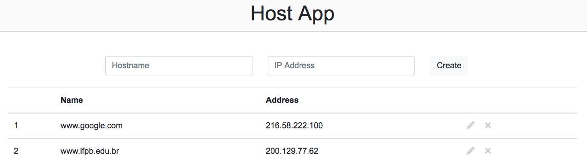

# Host Simple App (DB)

```
host-simple-db
├── api
│   └── v1
│       └── index.php
├── database
│   ├── config.php
│   ├── database.php
│   ├── schema.mwb
│   └── schema.sql
├── install
│   └── index.php
├── model
│   └── host.php
└── public
    ├── css
    │   └── master.css
    ├── index.html
    └── js
        └── main.js
```



## Back-end side
---

```
host-simple-db
├── api
│   └── v1
│       └── index.php
├── database
│   ├── config.php
│   ├── database.php
│   └── schema.sql
├── install
│   └── index.php
└── model
    └── host.php
```

### [Host Simple API (DB)](../../web-api/codes/db/host/)


[database/schema.sql](database/schema.sql):
```sql

```

### Install

[http://localhost:8080/php/web/web-api/codes/db/host/install/](http://localhost:8080/php/web/web-api/codes/db/host/install/):
```php

```

[database/config.php](database/config.php):
```php

```

## Front-end side
---

```
host-simple-db
└── public
    ├── css
    │   └── master.css
    ├── index.html
    └── js
        └── main.js
```

[public/index.html](public/index.html):
```html

```

[public/css/master.css](public/css/master.css):
```css

```

[public/js/main.js](public/js/main.js):
```js

```
